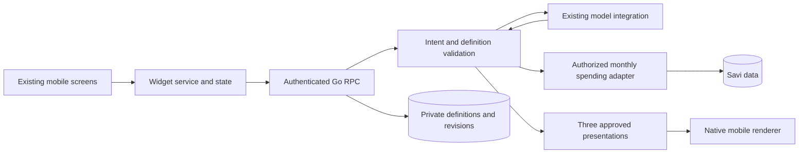

# Savi AI Widgets — MVP Proposal v0.1

**Status:** Proposed for team and Savi review · **Date:** 27 September 2026

**Delivery:** A feature inside the existing Savi mobile app, backed by Savi services. This document specifies work to build; it does not report a completed implementation or partner approval.

## 1. Product outcome

A user describes a monthly-spending view, compares three designs, and saves the one they prefer. They can reopen it, pin and organize it on their dashboard, refine a selected part, undo a refinement, and share its reusable design with another Savi user. The recipient connects their own account and sees their own spending.

Example: **“Show my monthly spending from January to March 2026.”** After confirming an eligible account and dates, the user sees Bar, Line, and Donut alternatives showing the same monthly amounts and total. The model interprets the request; authenticated application code supplies the financial values.

The [interactive D1 mockup and walkthrough](<Mockup/CSC301 — AI Widgets Prototype/readme.md>) demonstrate the intended interaction with preset text and fictional values. They are design evidence, not evidence of backend integration, arbitrary text entry, or finished MVP functionality. The mockup also explores changing presentation after saving; v0.1 commits to the initial three-choice selection and defers that later switching control.

### Proposed release boundary

| Area | v0.1 commitment |
| --- | --- |
| Financial question | Monthly gross spending for one explicitly selected, active personal CAD account with CAD-denominated transactions |
| Period | 1–12 consecutive completed calendar months; fixed dates confirmed before generation; America/Toronto timezone for this release |
| Three choices | Bar, Line, and Donut, built from one validated intent and one canonical dataset |
| Saving | Choose one design to save one private widget; unselected candidates do not enter the saved library |
| Reuse | Reopen the stored definition without another generation call; refresh its financial values from authorized services |
| Dashboard | Pin, unpin, and reorder alongside existing widgets; placement survives restart on the same device |
| Refinement | Select the title or chart; change title text, Gold/Blue palette, or Bar/Line grid visibility; Undo is required |
| Sharing | Export/import a bounded `.savi-widget.json` template through native file sharing and file selection; recipient chooses their own account and dates |
| Removal | Confirm removal from the saved library and dashboard; no promise of permanent database erasure |
| Platforms | Existing iOS and Android mobile app; integrated testing on both, followed by Savi's release review |

**Scope direction confirmed during preparation:** include both three-design selection and reusable sharing, and limit the first release to monthly spending. This is the author's requested proposal scope; team and partner acceptance remain outstanding.

**Sharing scope change requiring agreement:** earlier project planning treated snapshot sharing with data as core and reusable definitions as bonus. This version proposes reusable templates as the primary sharing deliverable and defers image export. That replacement needs partner agreement and reconciliation with course expectations. Until that agreement is recorded, the earlier snapshot obligation remains unresolved; this proposal must not be marked fully accepted or the final MVP declared complete. If replacement is declined, add and estimate image export explicitly before baselining scope.

**Deferred:** other financial questions, category breakdowns, multiple accounts/currencies, FX conversion, household profiles, rolling/current partial months, additional chart types, freeform layout generation, executable UI code, public live links, marketplace/discovery, collaborative editing, redo, presentation switching after saving, and cross-device dashboard-order synchronization. Reusable file sharing does not require public hosting. The TA can continue using the linked Figma prototype for D1.

## 2. User journey and acceptance criteria

The core journey is: **Describe → confirm account and months → generate → compare three designs → choose and save → reopen or pin → refine/undo → share/import or remove.** Saved-library membership and dashboard placement are separate states.

### US-01 — Describe a supported view

As a Savi personal-account user, I want to describe a monthly-spending view in order to understand my spending without building a report manually.

- A supported natural-language request leads to an explicit account and month-range confirmation. Missing or ambiguous dates require clarification; unsupported questions explain the supported scope.
- The backend verifies personal-profile access and account ownership, eligibility, currency, and date limits. Client-supplied IDs alone never grant access.
- Monthly amounts come from the authorized data layer. No amount generated by the model is accepted as financial data.
- Empty input, unauthorized accounts, invalid model output, and generation failures leave the saved library unchanged and show a recoverable state.

### US-02 — Compare three designs and save one

As a user, I want to compare three presentations in order to choose the clearest view of the same information.

- Bar, Line, and Donut share identical account, months, currency, monthly values, and total. The donut shows each month's share of the period total, with a month legend; it does not imply spending categories.
- Choosing one alternative saves exactly one private widget with that presentation. Double taps and retried responses do not create duplicates.
- Cancel before selection saves nothing. Expired candidates explain that regeneration is needed. All-zero data displays an empty state, never a fabricated donut percentage.
- Each alternative is a native component composition with readable values and labels, not a generated image.

### US-03 — Reopen and refresh

As a user, I want to reopen a saved widget in order to reuse the view without asking the AI to rebuild it.

- After app restart, the private library contains the selected widget once, with the saved title, presentation, and style. Opening it makes no generation call.
- Opening or manually refreshing fetches current authorized data for the same fixed months. Backfilled or corrected transactions may change values; the definition and month range remain unchanged.
- Loading, zero spending, and data failure are distinguishable. Show when data was fetched. A failed refresh may retain clearly marked data only within the current authorized session; a fresh session shows an error rather than invented zeros.
- Losing account access produces an unavailable state and clears affected cached values. Another user cannot read the private definition or its data.

### US-04 — Organize the dashboard

As a user, I want to pin, unpin, and reorder widgets in order to keep my most useful views easy to reach.

- Pin creates one dashboard reference. Repeating Pin does not duplicate it. Built-in and generated widgets can be reordered together.
- Position and pin state survive restarting the app on the same device and account. Existing built-in preferences survive migration.
- Unpin removes dashboard placement while preserving the saved widget and its edit history. Removal from the library is a separate confirmed action.
- Generated widgets are shown only in the eligible personal profile. Logout/profile changes cancel requests and prevent stale financial content from flashing in the next context.

### US-05 — Refine a selected part

As a user, I want to refine a selected title or chart in order to personalize the widget without changing unrelated content.

- The selected element is visibly identified. Supported requests are a title change, Gold/Blue palette change, and showing/hiding the grid on Bar or Line. Donut has no grid control.
- A refinement targets a stable node ID and expected revision. Only the permitted property of that node changes; other nodes, chart type, account binding, month range, and dashboard position remain identical.
- The existing dataset stays unchanged during the edit. Financial refresh is a separate action, so a style edit cannot silently change the displayed amounts.
- Unsupported edits, invalid patches, or stale revisions preserve the last valid version and explain how to retry or reload. A title change updates the library's display name consistently.

### US-06 — Undo a refinement

As a user, I want to undo a successful refinement in order to recover the previous design.

- Undo restores the preceding accepted definition and title, without calling the model or rolling back financial transactions. It is available after reopening when prior history exists.
- Failed edits do not consume history. Undo at the initial version is disabled with a clear explanation. Redo is outside v0.1.
- An expected-revision check prevents an edit or Undo from overwriting another accepted mutation. Revisions increase even when Undo restores older content.

### US-07 — Share and import a reusable template

As a Savi user, I want to share a reusable design in order to let another user apply it to their own spending.

- Share previews a sanitized template and opens the native share sheet. Cancellation does not change the widget or its privacy setting.
- Export includes only approved presentation settings and the supported monthly-spending data requirement. It uses the neutral title “Monthly Spending”; it excludes custom text, account/widget/profile IDs, amounts, raw prompts, edit history, and credentials.
- Import validates file size, schema version, components, and every property before preview. Invalid, unsupported, or malicious files cannot execute code or call arbitrary services.
- The recipient explicitly selects an eligible account they own and confirms months. Preview uses that account's data; Save creates an independent private widget. Preview/cancel creates no saved object, retries do not duplicate it, and import makes no LLM call.
- Edits or removal of either saved copy do not affect the other. The source widget is never made public as a shortcut for sharing.

### US-08 — Remove a saved widget

As a user, I want to remove a widget I no longer need in order to keep my library and dashboard organized.

- Confirmation removes it from the saved list and dashboard; cancellation changes nothing. It stays absent after restart and the next library sync on another device.
- Normal owner read/edit/export operations reject the removed widget. Server-side retention follows Savi's policy; the UI says “Remove widget,” not “Permanently erase.”
- Unrelated widgets and previously imported independent copies remain available. Only the owner may remove their widget.

### US-09 — Recover from failure

As a user, I want clear loading and failure states in order to recover without losing saved work.

- Generation ends in choices or an actionable failure within a proposed 30-second deadline. Data requests end within 15 seconds. These are timeout budgets, not measured performance claims.
- Each generation attempt permits one initial model call and at most one repair call within the same deadline. There are no endless retries; manual Retry starts a new attempt.
- Save/Edit/Undo show success only after persistence is confirmed. A lost response is reconciled by operation ID before another mutation is submitted.
- All flows support accessible labels, readable text scaling, a text equivalent of chart values, and indicators that do not rely only on color. Narrow-screen layouts and existing dashboard functionality remain usable.

## 3. What the code already supports

The following is a source-level audit of Savi `ce` at commit `604122cc8bc3bd13a16c34fe8c43192f33f82fa5`. Links require access to Savi's repository. Inspection establishes integration opportunities and gaps; it does not establish that the feature has passed runtime tests.

| Existing evidence | Consequence for v0.1 |
| --- | --- |
| [Generator and validation](https://github.com/cheapreats/ce/blob/604122cc8bc3bd13a16c34fe8c43192f33f82fa5/sf1/api/widgetgen/generator.go#L36) return a component tree and resolver descriptors; validation checks the root Card/title and selected resolver rules. | Reuse the provider integration; add the narrower versioned contract, recursive validation, data binding, and bounded repair. Resolver descriptors are not an implemented data-execution layer. |
| [Create handler](https://github.com/cheapreats/ce/blob/604122cc8bc3bd13a16c34fe8c43192f33f82fa5/sf1/api/rpc/handlers/create_widget/handler.go#L64) immediately generates, stores a widget, then links it to the user; it has a lifetime cap of 100 widget documents. | A new candidate/commit path is necessary. Calling existing Create three times would save three widgets. Separate insert/link failures and quota accounting need retry-safe handling. |
| [Get](https://github.com/cheapreats/ce/blob/604122cc8bc3bd13a16c34fe8c43192f33f82fa5/sf1/api/rpc/handlers/get_widget_code/handler.go#L47) parses the latest definition; [List](https://github.com/cheapreats/ce/blob/604122cc8bc3bd13a16c34fe8c43192f33f82fa5/sf1/api/rpc/handlers/list_widgets_code/handler.go) exposes stored widget history. | Normalize different response shapes and JSON strings in a service adapter. Get does not resolve financial data. Keep newly created widgets private. |
| [Update](https://github.com/cheapreats/ce/blob/604122cc8bc3bd13a16c34fe8c43192f33f82fa5/sf1/api/rpc/handlers/update_existing_user_widget_prompt/handler.go#L79) regenerates from accumulated prompts, caps history at 20, and copies full history when cloning public widgets. | It is not selected-node editing or sanitized template import. Add exact patch constraints, version checks, and fresh private import. |
| [Undo](https://github.com/cheapreats/ce/blob/604122cc8bc3bd13a16c34fe8c43192f33f82fa5/sf1/api/rpc/handlers/undo_widget_prompt/handler.go#L70) pops stored history; [Delete](https://github.com/cheapreats/ce/blob/604122cc8bc3bd13a16c34fe8c43192f33f82fa5/sf1/api/rpc/handlers/delete_widget/handler.go#L62) only unlinks a saved-list ID. | Reuse the history concept, add revision-safe mutations and defined removal checks. Delete cannot serve as Unpin and does not currently block direct owner reads. |
| [Dashboard renderer](https://github.com/cheapreats/ce/blob/604122cc8bc3bd13a16c34fe8c43192f33f82fa5/sba-mobile/screens/tabs/home/home-screen/WidgetRenderer.tsx#L195) handles fixed IDs; [UI state](https://github.com/cheapreats/ce/blob/604122cc8bc3bd13a16c34fe8c43192f33f82fa5/sba-mobile/shared/ui/uiStateManager.ts#L379) filters against defaults. | Add typed generated-widget references and a persistence migration; merely appending backend IDs would not work. Current local state is keyed by login user, not active profile. |
| [Chat renderer](https://github.com/cheapreats/ce/blob/604122cc8bc3bd13a16c34fe8c43192f33f82fa5/sba-mobile/components/ask-savi/ChatComponentRenderer.tsx#L46) handles fixed financial component specs; [native widget types](https://github.com/cheapreats/ce/blob/604122cc8bc3bd13a16c34fe8c43192f33f82fa5/sba-mobile/services/widgets/customWidgetTypes.ts#L35) describe transaction widgets. | Useful patterns, but neither is the required recursive AI-widget renderer or saved library. |

### Component reuse first

| Approved node | Reuse and required work |
| --- | --- |
| Card | Wrap [SaviWidget](https://github.com/cheapreats/ce/blob/604122cc8bc3bd13a16c34fe8c43192f33f82fa5/sba-mobile/components/shared/widgets/SaviWidget.tsx#L58) and the existing theme; give its title a selectable Card target. |
| Text | Reuse [PageSectionTitle](https://github.com/cheapreats/ce/blob/604122cc8bc3bd13a16c34fe8c43192f33f82fa5/sba-mobile/components/shared/text/PageSectionTitle.tsx#L10) and theme typography through bounded semantic text/metric adapters. |
| BarChart | Adapt [BaseCashflowGraph](https://github.com/cheapreats/ce/blob/604122cc8bc3bd13a16c34fe8c43192f33f82fa5/sba-mobile/components/insights/BaseCashflowGraph.tsx#L128); add safe typed inputs and configurable grid visibility, currently fixed by `hideRules={false}`. |
| LineChart | Adapt the chart used by [NetworthGraphChatCard](https://github.com/cheapreats/ce/blob/604122cc8bc3bd13a16c34fe8c43192f33f82fa5/sba-mobile/components/ask-savi/NetworthGraphChatCard.tsx#L43); remove net-worth-specific assumptions from the monthly series adapter. |
| PieChart, variant `donut` | No reusable mobile donut wrapper was found in the inspected sources. Build an approved native adapter, verify the chart library API, and test labels, total, empty data, and accessibility. |

Host screens own buttons, selection controls, and chart layout using existing Savi components and spacing. The initial schema needs no generated Button, arbitrary Row/Column, callbacks, URLs, or custom styles. Atomic Design informs reuse boundaries; a design-system rewrite is outside this MVP.

## 4. Architecture and financial contract



Use TypeScript/React Native/Expo, existing Savi styling/state patterns, Go JSON-RPC, MongoDB, and the existing OpenRouter integration. Exact RPC names below are design concepts, not APIs already available. Start with a bounded pipeline; an autonomous agent framework is not a prerequisite.

### Financial semantics

- **Ownership:** one active account belonging to the authenticated personal profile; verify this for preview, commit, reopen, refresh, and import. Household/other-profile access is outside the release.
- **Spending:** sum magnitudes of eligible negative transaction amounts. Exclude deleted transactions, analytics-excluded transactions, all `TRANSFER` types, and legacy `TRANSFER_IN`/`TRANSFER_OUT` categories. Positive refunds/income do not offset gross spending. Label the metric accordingly; it is not net cash flow.
- **Currency and units:** account and included transactions must be CAD; reject mixed/unknown denomination rather than silently treating it as CAD. Each eligible input must have an explicit CAD denomination and a finite, safe integer minor-unit amount; fractional cents or missing currency produce an unsupported-data state, not rounding or a zero bucket. Some legacy data may therefore be ineligible and must be covered by compatibility tests. Compute in integer cents and display CAD dollars with two decimals. The existing [aggregation](https://github.com/cheapreats/ce/blob/604122cc8bc3bd13a16c34fe8c43192f33f82fa5/sf1/api/analytics/analytics.go#L60) groups raw amounts by account currency and is not an FX conversion facility.
- **Months:** freeze explicit `firstMonth` and `monthCount` after user confirmation. Each month runs from local midnight on its first day to just before the next local month's midnight, in America/Toronto. For an inclusive-millisecond API, use next-month start minus 1 ms, including DST offset changes. Never substitute “last 30 days” for a calendar month.
- **Normalization:** fill missing month buckets with zero, order them chronologically, and return `currency`, `series[{period, amountMinor}]`, and `totalAmountMinor`. One canonical result feeds all three choices. Total must equal the sum of the series; no negative, non-finite, unsafe-integer, or model-authored values are accepted.

**Required backend correction:** the existing [time-range handler's transfer filter](https://github.com/cheapreats/ce/blob/604122cc8bc3bd13a16c34fe8c43192f33f82fa5/sf1/api/rpc/handlers/get_analytics_by_time_ranges/handler.go#L132) checks legacy categories, not every transaction marked `TRANSFER`. The new widget data adapter must enforce the above predicate and currency checks, reusing authorized data access and aggregation primitives. Do not claim that passing `includeTransfers: false` alone already satisfies this proposal; any change to shared analytics requires regression review.

### Versioned definition

Separate the **definition** (presentation and data requirement), **private binding** (owner/account), and **resolved data** (financial values). A logical account slot connects them; portable definitions never carry source account IDs. Backend code resolves only the named `monthlyExpenseV1` capability after authorization; no arbitrary RPC dispatch, JavaScript, expression evaluation, or unrestricted JSON paths.

Illustrative v0.1 definition — **proposed schema, not a drop-in request for the current generator**:

```json
{
  "schemaVersion": 1,
  "dataRequirements": [{
    "id": "spending",
    "kind": "monthlyExpenseV1",
    "accountSlot": "primary",
    "currency": "CAD",
    "firstMonth": "2026-01",
    "monthCount": 3,
    "timezone": "America/Toronto"
  }],
  "componentTree": {
    "id": "card",
    "type": "Card",
    "props": { "title": "Monthly Spending" },
    "children": [
      {
        "id": "total",
        "type": "Text",
        "props": { "role": "metric", "format": "currency" },
        "binding": { "dataId": "spending", "field": "totalAmountMinor" }
      },
      {
        "id": "chart",
        "type": "BarChart",
        "props": { "palette": "gold", "gridVisible": true },
        "binding": { "dataId": "spending", "field": "series" }
      }
    ]
  }
}
```

The other alternatives keep the same data requirement and stable targets, using `LineChart` or `PieChart` with `variant: "donut"`; the donut omits `gridVisible`. The renderer supplies period/currency captions and chart legends from validated context.

Proposed validation limits: UTF-8 definition/import size ≤32 KiB, ≤20 nodes, depth ≤4, one data requirement, 1–12 month buckets, title ≤80 characters, and prompt ≤1,000 characters. Require unique node IDs, a root Card with `props.title`, children only in `children`, approved types/props/bindings, and valid type-specific property combinations. Reject unknown schema versions, missing bindings, unexpected fields, and out-of-range values. Validate on the server and again at the mobile boundary; unsupported old definitions get an explanatory state, not silent partial rendering. Final schemas and shared conformance fixtures are the first implementation deliverable.

## 5. Lifecycle and mutation rules

### Candidates, persistence, and quotas

Add authenticated prepare/commit operations alongside the existing immediate-save path. Prepare interprets and validates one intent, resolves one authorized dataset, then constructs three approved presentations. Candidate sets belong to one personal profile, expire after a proposed 10 minutes, and do not count as saved widgets. Cancel clears the preview. The contract/data spike will choose a signed client-held preview reference or short-lived server storage; a separate candidate database/service is not a product requirement. Either approach must prevent tampering, cross-user commits, and expired saves.

Account and month controls are authoritative after confirmation; the model cannot override them. If the prompt conflicts with those fields, ask the user to resolve the conflict rather than generating a different range. The baseline has no separate model call before confirmation; the initial interpretation and any one repair share the stated attempt budget.

Commit takes a candidate-set ID, choice, and idempotency key. At most one saved widget may result from a candidate set, even when two selections carry different keys: return the committed result or a defined already-committed conflict. Authenticate and resolve completed operations before rechecking expiry/quota so lost responses remain recoverable; a replay must never resurrect a removed widget. For a new commit, recheck ownership, eligibility, expiry, validation, and quota before storing one selected private definition. Preserve the existing 100-document lifetime limit unless Savi explicitly changes it; explain a reached limit before a paid generation call where possible and recheck atomically at commit. Candidates and duplicate retries must not consume extra quota.

The widget insert and user-list link are separate writes today. The new path needs durable operation identity and retry/reconciliation of partial writes, with unique saved-list membership; it must not depend on unavailable multi-document transactions. Do not report Save success before both storage and library visibility are confirmed. After selection begins, an interrupted client checks operation status on resume rather than treating the outcome as unsaved.

Server definitions/history survive sessions and devices. Dashboard layout remains device-local. Extend layout references to distinguish built-in IDs and generated widget IDs, migrate existing preferences, and scope generated placement to the authenticated user and personal profile. Filter unavailable/removed IDs after server reconciliation without discarding valid built-in preferences.

### Selected edits and Undo

A mutation carries `widgetId`, `expectedRevision`, `selectedNodeId`, the requested refinement, and an operation ID. The server interprets it as an allowlisted property patch, checks exact before/after invariants, validates the entire result, and atomically compares/updates the widget revision. It does not regenerate and replace the whole tree from a concatenated conversation.

The Card's title is the source of truth; update stored display-name metadata in the same widget mutation. Store accepted definition versions and bounded refinement context privately. For v0.1, retain the existing maximum of 20 stored versions including the initial version; at the limit, explain that the user must Undo before another edit. Undo pops one accepted version, increments the separate monotonic revision, and uses no model call. It restores design state, not historical financial data, pin position, or a removed widget. Failed/conflicting mutations leave history unchanged.

Show a compact refinement history and Undo state within the widget editor, following the Figma interaction. A full Ask Savi conversation, unrelated chat actions, and a separate chat-history product are outside scope.

### Template sharing and import

Build exports from an allowlist into a fresh template envelope: `templateVersion`, `schemaVersion`, the sanitized component tree, and an unbound `monthlyExpenseV1` requirement. The unbound template has its own schema; the complete saved-definition schema above requires confirmed dates. Omit owner/account/widget/profile identifiers, prompts/history, values, dates/timestamps, and arbitrary text; replace the title with “Monthly Spending.” Use template-local node/data IDs and remap their references consistently on import. The recipient supplies their own fixed months and private account binding, so the complete saved definition is reconstructed only after confirmation. The outgoing preview must show exactly the portable content.

Use the native share sheet for `.savi-widget.json` and a visible “Import template” action with a file picker. Validate before preview, resolve the recipient's data server-side, and require an explicit Save through the same idempotent persistence rules. Imported templates receive fresh widget/node identity and initial history; they do not clone public-widget history or inherit author access. No public URL, live source connection, or automatic AI regeneration is required.

### Privacy, failure, and compatibility

Only the user's prompt/refinement and approved schema context go to the model; application code supplies account bindings and resolved amounts. Prompts may themselves contain personal text, so use Savi's approved provider/retention policy and avoid raw prompts, definitions, or financial values in diagnostic logs. Session changes clear financial caches and cancel pending work. All reads and mutations enforce owner, profile, and active/removed-state checks.

Add a removal state/check for new widgets rather than treating the existing unlink-only endpoint as full removal. Imported copies remain independent. Version or add the new contracts explicitly, preserving legacy behavior for legacy records. Every legacy read/update/Undo/remove route must guard or route the new schema-version-1 records through the new ownership, removal, schema, and revision rules; an old endpoint must not bypass them. Shared quota enforcement must cover every enabled creation path, including legacy Create, public clone-on-edit, new Commit, and template import. Roll out behind a Savi-approved feature flag, with saved definitions retained if the feature is disabled.

## 6. Acceptance fixtures and verification

Use deterministic backend fixtures for contract tests and two authenticated test identities for integration. Fixture values are test data, not real user balances. A fake provider must return distinct edit versions so Undo tests cannot pass merely because both versions are identical.

| Fixture A: owned CAD account, Jan–Mar 2026 | Eligible signed transaction amounts in cents | Expected monthly spending |
| --- | --- | --- |
| January | -100000, -20000 | CAD 1,200.00 |
| February | -85000, -10000 | CAD 950.00 |
| March | -100000, -45000 | CAD 1,450.00 |
| **Total** | **-360000** | **CAD 3,600.00** |

For A, the canonical series is `120000, 95000, 145000` cents. Add income, a positive refund, deleted/excluded rows, legacy-category transfers, a negative `TRANSFER` with category `OTHER`, and a transaction at April 1 local midnight; none may change the expected total. A negative `TRANSFER/OTHER` of 1,000 cents exposes the current filter gap: including it incorrectly produces CAD 3,610.00. Test month-boundary timestamps and March's DST change explicitly.

Fixture B belongs to a different user and has monthly spending of CAD 600.00, 300.00, and 900.00 (total CAD 1,800.00). Importing A's template as B must show B's values, while attempting to bind A's account must fail.

| Test group | Required evidence |
| --- | --- |
| Intent/data | Supported/ambiguous/unsupported prompts; ownership and currency checks; fixed month bounds; transfer/refund semantics; totals; zero months; deleted accounts |
| Renderer/schema | All three native presentations; same dataset; one-month Line with one visible point; twelve-month charts and Donut legend; malformed/unknown/deep/oversized trees; invalid bindings; zero donut; readable labels, screen reader values, and narrow layouts |
| Candidate/save | No saved entries before selection; one after; cancel/expiry; quota boundary; simultaneous commits; double taps; lost responses and insert/link recovery |
| Library/dashboard | Restart and cross-session definition recovery; no reopen LLM calls; mixed built-in/generated ordering; migration; duplicate pin; unpin; removal; profile/logout isolation |
| Refinement/history | Exact allowed-property diff; unchanged binding/data; title consistency; unsupported edits; two stale clients; retry-safe Undo; history limit; distinct pre/post fixtures; legacy endpoints cannot bypass v0.1 guards |
| Sharing | Payload inspection for excluded fields; invalid file/version; cancellation; B's data; fresh private identity; independent copies; no model calls on import; native file flows on both platforms |
| Failure/release | Timeout/repair limits; offline/data failure distinguished from zero; last valid definition preserved; feature flag off/on; existing widget regressions |

The acceptance walkthrough is: generate A → compare three choices → save Line → restart/reopen → pin/reorder → select chart and make Blue → Undo → unpin while retaining the library entry → share template → import as B → verify CAD 1,800.00 → remove A's widget → confirm B's copy remains. Repeat chart-specific checks for Bar and Donut.

## 7. Workstreams and delivery gates

These are implementation workstreams, not assigned team roles or promised dates. Assign people and estimates after agreeing the contracts. Each owner implements tests and reviews another stream; integration is continuous.

| Stream | Deliverable and primary dependency |
| --- | --- |
| A — Native rendering | Reuse inventory, schema-to-component adapters, Bar/Line/Donut, accessibility; shares schema fixtures with C |
| B — Creation and library | Prompt/confirmation, three-choice flow, saved library, request state/recovery; consumes A and C |
| C — Generation and financial data | Bounded generation/validation, authorized spending adapter, fixture semantics, candidate/commit and quota contracts |
| D — Dashboard and editor UI | Layout migration, pin/order/unpin/remove, selected-element controls and history; integrates B and E |
| E — Lifecycle and sharing backend | Revision-safe patches/Undo/removal, sanitized template validation/export/import; uses C's data and persistence contracts |
| F — Sharing UI and integration | Native export/file import, two-user walkthrough, cross-feature regression harness and demo evidence; integrates A–E |

For five developers, B can take the bounded sharing UI while integration coordination rotates. Do not leave financial-data resolution unowned or make one person responsible only for testing.

1. **Contract gate:** agree calculation rules, candidate save semantics, schema/limits, editing, platform targets, sharing replacement, and fixtures. Prototype the missing donut adapter early. Freeze shared fixtures before parallel implementation diverges.
2. **First real slice:** existing mobile app → authenticated monthly-data adapter → validated Bar preview → explicit selection/commit → restart/reopen the one private widget. It must use the real service/data path with test accounts, not only hard-coded component data.
3. **Three-choice gate:** add Line/Donut and prove shared values, cancel/expiry, idempotent save, library recovery, and quota behavior. This realizes the full selection story.
4. **Lifecycle gate:** mixed dashboard placement, selected-property edits, history/Undo, and removal with revision and profile isolation. Backend edits and dashboard UI can proceed in parallel after the common contract.
5. **Sharing gate:** export/import with two distinct users, own-account rebinding, no leaked source fields, and independent copies. This can develop in parallel once schema and persistence are stable.
6. **Release candidate:** execute the acceptance walkthrough and failure matrix on iOS and Android, run applicable repository checks, record evidence and limitations, and obtain review for a feature-flagged integration through Savi's normal deployment process.

Do not cut either three choices or reusable sharing silently if estimates exceed capacity. Propose a revised scope to the team/partner before changing the baseline. Public live links, more financial domains, and arbitrary layouts remain later work.

## 8. Definition of done and review decisions

The implemented MVP is complete only when all accepted stories pass in the integrated Savi app; schema/data invariants, ownership, persistence, edit/Undo, and two-user sharing have reproducible evidence; changed-code repository checks pass; existing dashboard behavior remains intact; and setup, feature-flag instructions, API/schema documentation, and known limitations are committed. Record the tested app/backend revisions and platforms. Figma playback, source inspection, and this proposal PR do not count as those implementation tests.

| Decision before scope is baselined | Proposed default / review needed |
| --- | --- |
| Sharing versus original brief | Templates replace snapshot export; obtain Savi agreement and reconcile course expectations, or explicitly add/estimate snapshot export |
| Financial definition | One personal CAD account; Toronto completed months; gross negative outflows excluding transfers; Savi confirms business semantics and test data |
| Contract and rollout | Add/version APIs; private-only widgets; 100-document/20-version existing limits; Savi reviews quota concurrency, retention, model handling, and feature-flag approach |
| Delivery ownership | Team assigns workstreams, estimates gates, and records supported test devices/build access; no names or dates are invented here |

**Partner-review evidence: pending.** Link the actual review communication, meeting decision, or approval here when it exists. The proposal has not been sent to the partner as part of preparing this document, and no acceptance is implied.

### Basis and relationship to earlier material

This proposal synthesizes the supplied `SAVI_CSC301_MVP_FORMAL.md`, the supplied “Ralph Feedback & Key Project Takeaways,” the existing design prototype, and the pinned code audit above. Ralph's recorded feedback supports reusing Savi components and reconsidering the value of screenshot sharing; it does not by itself establish approval of reusable-template sharing. Three choices and reusable sharing are explicitly included at the author's request.

Once accepted, this document becomes the detailed MVP scope linked from [D1 planning](planning.md). It resolves older draft wording that made three choices optional and Undo a “Should,” and proposes a change from snapshot-first sharing. Until acceptance, earlier documents remain historical context and the sharing change stays an explicit review item. This is a documentation proposal only; no Savi implementation or production deployment is included in this change.
