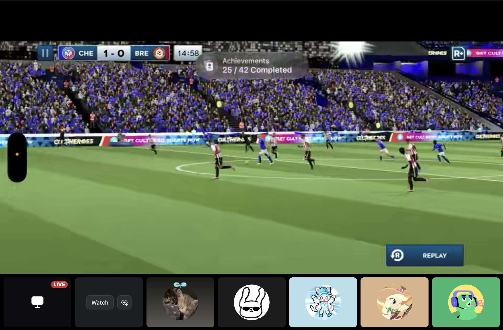
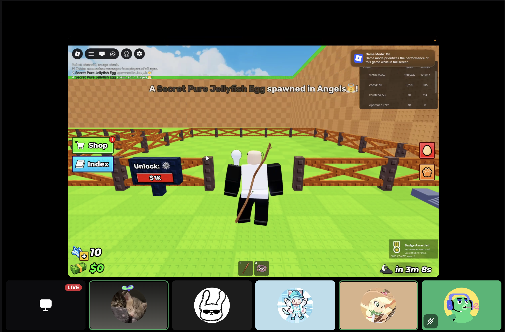
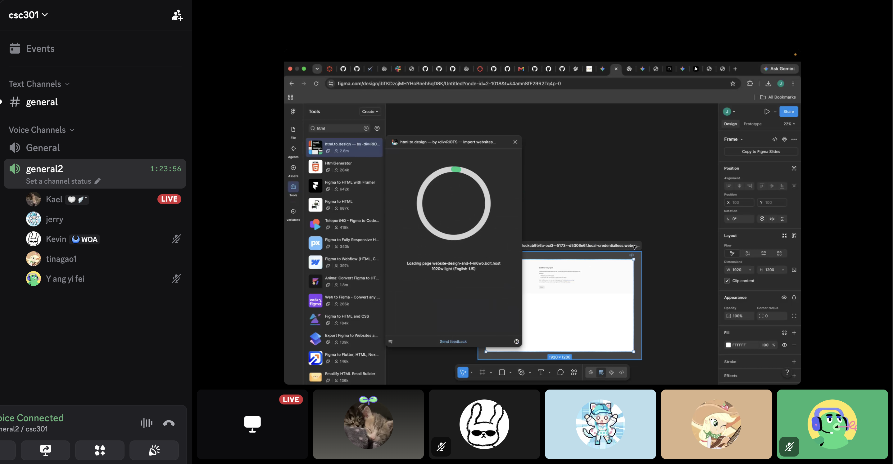

# Savi Finance Mobile App - 404 Team Name Not Found
> _Note:_ This document will evolve throughout your project. You commit regularly to this file while working on the project (especially edits/additions/deletions to the _Highlights_ section). 
 > **This document will serve as a master plan between your team, your partner and your TA.**

## Product Details
 
#### Q1: What is the product?

 Savi Finance is a personal finance mobile app that helps individuals and households in financial aspects, including understanding their money, managing everyday spending, planning for future goals in one place.
 We are building a generation agent in a mobile app which brings these activities together. Users can organize their accounts and transactions, review spending by category, track savings goals, and view projections of their future finances. Shared household features help people coordinate their finances, while an integrated assistant, Ask Savi, gives users a conversational way to ask financial questions.
 Some examples:
 •	Understand everyday spending: A user can review recent transactions and see how much they spend on groceries, transportation, and dining.
 •	Plan for a purchase: Someone saving for a vacation can track their progress and explore how the expense could affect their projected finances.
 Ralph Maamari, the Co-Founder of Savi Finance is our partner. Savi Finance’s goal is helping Consumers & Businesses automate & grow their finances all in one place with real-time collaboration, thousands of bank integrations (with AI Receipt Capture) and innovative regional insights (Compare Rent Costs).
 

#### Q2: Who are your target users?

Savi Finance targets young adults managing their own finances and couples coordinating household money. 

To be specific, consider Jessie, 25, a recent graduate in her first full-time job. Jessie receives a regular salary, pays rent, uses two credit cards, and is repaying a student loan. She checks her banking apps frequently but struggles to tell how much she can spend while still saving. She wants to build an emergency fund and budget for a vacation without maintaining a detailed spreadsheet. Savi helps review spending across accounts, organize transactions, and track savings goals, which further let her understand how today’s spending could affect her future balance. 

The target can also be young couples Alex and Judy, 29 and 31,managing shared household expenses. They recently moved in together. They decided to separate personal accounts but share rent, groceries and utilities for a home. Their financial information is spread across banking apps and a shared spreadsheet that is often out of date. They need a shared view of household finances to coordinate decisions. Savi’s household features help them review shared financial information, monitor expenses, and track progress toward common goals.

#### Q3: Why would your users choose your product? What are they using today to solve their problem/need?

Users would choose us because it strongly connects everyday spending and future planning in a single mobile app. For our target users, the benefit is being able to use their financial information to make practical decisions, whether they can afford a purchase, how their savings are progressing, or which expenses need attention.
Some benefits:
- Save time managing money: Savi brings account information, transactions, savings goals, and household finances into one app. Users can spend less time switching between banking apps or updating spreadsheets. One could review spending and savings progress in one session. This could save few minutes for every check. 
- Discover spending patterns: Categorized transactions help users see where their money goes across accounts. One could discover several small dining purchases add up to a significant share of their monthly budget. This information is harder to recognize when transactions are scattered across different accounts.
- Make better-informed plans: Current balances show how much money users have today, while financial projections help them explore how spending and saving could affect their future finances. Users could use this information to assess a vacation budget alongside their emergency savings goal. Projections are estimating whose usefulness depends on the available data and assumptions.

#### Q4: What are the user stories that make up the Minimum Viable Product (MVP)?

Our [MVP proposal v0.1 and full acceptance criteria](mvp.md) define the proposed release: monthly spending for one owned personal CAD account, three design choices, saved widgets, dashboard organization, selected-part editing with Undo, and reusable-template sharing. Dates are explicitly confirmed and limited to 1–12 completed calendar months. This proposal is prepared for team and Savi review; it is not yet partner-approved.

1. **US-01 — Generate a supported view.** As a Savi personal-account user, I want to describe a monthly-spending view in order to understand my spending without building a report manually. **Acceptance:** confirm account and months; use authorized financial data; clarify ambiguous requests; reject unsupported input without saving a broken widget.
2. **US-02 — Choose a design.** As a user, I want to compare three presentations in order to choose the clearest view of the same information. **Acceptance:** Bar, Line, and Donut use identical monthly values and total; choosing one saves exactly one private widget; cancelling saves nothing and retrying does not create duplicates.
3. **US-03 — Reopen and refresh.** As a user, I want to reopen a saved widget in order to reuse the view without asking the AI to rebuild it. **Acceptance:** the selected definition survives restart; reopening makes no generation call; refresh uses the same fixed months; failure is distinguishable from zero spending.
4. **US-04 — Organize the dashboard.** As a user, I want to pin, unpin, and reorder widgets in order to keep my most useful views easy to reach. **Acceptance:** generated and built-in widgets can be ordered together; placement survives restart on the same device; unpinning preserves the saved widget.
5. **US-05 — Refine a selected part.** As a user, I want to refine a selected title or chart in order to personalize the widget without changing unrelated content. **Acceptance:** only an allowed title, Gold/Blue palette, or Bar/Line grid property changes; data bindings and unrelated nodes remain unchanged; invalid or stale edits preserve the last valid version.
6. **US-06 — Undo a refinement.** As a user, I want to undo a successful refinement in order to recover the previous design. **Acceptance:** Undo restores the preceding stored definition without a model call; failed edits do not consume history; concurrent changes cannot be silently overwritten.
7. **US-07 — Reuse a shared template.** As a Savi user, I want to share a reusable design in order to let another user apply it to their own spending. **Acceptance:** export excludes source identifiers, private amounts, custom text, and prompts/history; import validates the file and uses the recipient's own authorized account and confirmed months; the saved copy is private and independent.
8. **US-08 — Remove a widget.** As a user, I want to remove a widget I no longer need in order to keep my library and dashboard organized. **Acceptance:** confirmation removes it from both surfaces and blocks normal read/edit/export; cancellation changes nothing; removal does not claim permanent database erasure or delete imported copies.
9. **US-09 — Recover from failure.** As a user, I want clear loading and failure states in order to recover without losing saved work. **Acceptance:** bounded requests expose actionable retry states; persistence is confirmed before success is shown; accessible controls and readable chart values work across the supported flows.

**Sharing change for review:** earlier project planning made snapshot sharing core and reusable definitions bonus. This proposal includes reusable sharing and proposes deferring image export. Partner agreement and reconciliation with course expectations are required before accepting that replacement; the earlier snapshot obligation remains unresolved until then.

**Partner-review evidence: pending.** Add a link to the actual review message, meeting record, or approval when it exists. Preparing this proposal does not establish that it has been communicated to or accepted by the partner.

#### Q5: Have you decided on how you will build it? Share what you know now or tell us the options you are considering.

We propose extending the existing Savi app and backend. The [MVP proposal](mvp.md) contains the architecture diagram, source-code audit, contracts, workstreams, and acceptance fixtures.

- **Stack and reuse:** TypeScript, React Native, Expo, existing Savi styling/state patterns, Go JSON-RPC services, and MongoDB. Reuse card/text components and adapt existing Bar/Line charts; add an approved native Donut adapter. The current generator uses OpenRouter; model/provider configuration remains a Savi engineering decision.
- **Architecture:** mobile screens call a widget service and authenticated backend. A bounded generation pipeline interprets intent; application code validates ownership, obtains monthly spending, and supplies one dataset to three native presentations. Add candidate/commit operations because existing creation immediately saves. Persist private definitions and revision history on the server; keep dashboard pin/order metadata local to the device. Constrained property patches support selected editing and Undo. Sanitized templates import against the recipient's own account.
- **Verification and deployment:** develop with local backend/test accounts and a compatible Expo development client. Use shared fixtures, focused mobile/Go tests, real-service integration checks, and iOS/Android walkthroughs; run applicable repository gates. Integrate behind a feature flag through Savi's existing mobile/backend release process after review. No new banking integration or separate public hosting platform is required. The [Figma mockup](<Mockup/CSC301 — AI Widgets Prototype/readme.md>) remains the immediately accessible D1 demo, distinct from the implemented MVP.

----
## Intellectual Property Confidentiality Agreement 

1. You can share the software and the code freely with anyone with or without a license, regardless of domain, for any use.
2. You can upload the code to GitHub or other similar publicly available domains.
3. You will only reference the work you did in your resume, interviews, etc. You agree to not share the code or software in any capacity with anyone unless your partner has agreed to it.

After the discussion, all the team members agree to the option 1,2,3 as stated above.
----

## Teamwork Details

#### Q6: Have you met with your team?

Yes, we have met with each other as a team both online and offline. We play online games together like roblox and DLS26. Some of us played badminton together at Atheletic Center during the weekends. We have already built group chat in both wechat and discord. Wechat for daily life discussions and not course related topics. Discord for course related and project related topics.

Some Fun Facts:
    Kevin is Saskatchewan Badminton Provincial Champion
    Jerry's latest wake up time is 17:40
    Kael will participate in North American Professional Delta Force Game

#### Q7: What are the roles & responsibilities on the team?

We divided the project work by use case, with each team member taking responsibility for specific features. Kevin and Yifei will be responsible for generating supported views, including prompt input, account and month confirmation, authorized data retrieval, and request validation. Ziheng will handle widget removal, including confirming the action, removing the widget from both surfaces, and blocking subsequent access. Ethan will be responsible for reopening and refreshing widgets, as well as organizing the dashboard. This includes saving and loading widget definitions, reopening widgets without regenerating them, and refreshing data for the selected fixed months.

Each teammate will have the chance to work on both the frontend and backend. Since our project involves AI, everyone will also have opportunities to use AI tools and develop AI-powered features. We divided the work based on each team member’s interests, allowing everyone to choose an area they enjoyed and wanted to explore. This gives each member an opportunity to build their skills while contributing to our shared goal. Although we have individual responsibilities, we also agreed to support one another whenever someone needs help.

Beyond coding, Kevin serves as our team leader and dedicated partner liaison. Kevin, Ziheng, and Yifei take on more responsibility for documentation. Ethan contributes to brainstorming and developing the project’s initial structure. Tina and Kael help coordinate communication among team members and organize group meetings.

#### Q8: How will you work as a team?

We plan to have meeting twice a week, online or in-person depending on the needs. If the meeting is online, we will have it through discord and phone calls. If the meeting is in-person, we probably will pick one library we like to meet up. The purpose of the meeting is mainly to dicuss each other's university life, the progress of current project and the plan for the future week. The main goal is to combine everyone's idea to a more mature big goal. There are also online coding sessions, where everyone discussing their latest ideas and update the progress. We have three meetings before D1 is due. The first one was a brief group discussion on welcoming everyone to the team and chat about our goal on this project. The second one was about D1. we spread D1 into sections and assign each team member a part of it. We work together to finish D1. The third one will be more about the project, we extend the discussion from D1 to more deep into the project. We discuss details about the work for each team members and the existing codebase given by our partner.

  
#### Q9: How will you organize your team?

Our team will use Jira, GitHub, Slack, and meeting minutes to organize and track our work. Jira will be our main task-management tool. Our project will be represented by an Epic, and larger features or tasks will be broken down into child tickets. GitHub will be used to manage code changes and pull requests, while Slack will be used for day-to-day communication and resolving blockers.
Tasks will be prioritized based on their importance to the MVP, project deadlines, dependencies between features, and feedback from our partner. Core features and blocking tasks will be completed before lower-priority enhancements.
Tasks will be assigned according to each team member’s responsibilities and the part of the system they are working on. When necessary, larger tasks will be divided into smaller tickets so that work can be distributed clearly among team members.
We will use Jira ticket status and GitHub pull requests to track progress from the time a task is created until it is completed. Meeting minutes will also be used to record important decisions, action items, and changes in project direction. Our TA and project partner will be given access to the relevant project-management artifacts.

#### Q10: What are the rules regarding how your team works?

Communications:
Our team will use Slack for day-to-day communication, project updates, questions, and blockers. Team members are expected to check team messages regularly and respond to important messages within 36 hours. Important decisions, action items, and partner feedback will be documented so that all team members have a shared understanding of the project.
Communication with Savi Finance will primarily take place through Slack and scheduled partner meetings. Yifei Yang and Kevin will serve as the partner liaisons for the team. They will be responsible for coordinating communication with Savi Finance, arranging partner meetings, collecting questions from the team, and sharing partner feedback and decisions with the rest of the group.
Collaboration:
Team members are expected to attend scheduled meetings, complete assigned action items by the agreed deadlines, and communicate early if they are blocked or unable to complete a task. Progress will be tracked through our project-management tools and reviewed during team meetings.
If a team member is repeatedly unresponsive or does not complete their assigned work, the team will first contact them directly to understand the issue and agree on a recovery plan. If the problem continues, the issue will be discussed as a team and, if necessary, escalated to the TA or course staff.

## Organisation Details

#### Q11. How does your team fit within the overall team organisation of the partner?
Our team will primarily function as a product development team within Savi Finance. We are responsible for developing and integrating the AI-generated custom widget feature into Savi Finance’s existing mobile platform.
Rather than building a separate application, our team will work within Savi Finance’s existing engineering and product structure. We will use the existing mobile application, backend services, design system, and widget infrastructure while taking ownership of the new AI-widget user experience and its integration into the product.
Our work will involve both frontend and backend integration, including connecting the existing widget-generation functionality to the mobile application, rendering generated widgets safely, supporting widget lifecycle features, and helping define how users interact with generated financial visualizations.
We will also work closely with Savi Finance’s engineering and product team for requirement clarification, architecture decisions, feedback, and code review. This allows our team to contribute a new product feature while remaining aligned with the partner’s existing system and development process.

#### Q12. How does your project fit within the overall product from the partner?
Our project extends the existing Savi Finance mobile platform by adding AI-generated, customizable financial dashboard widgets. It is not a standalone application or a completely new product. Instead, it builds on Savi Finance’s existing mobile application, backend services, financial data infrastructure, and widget-generation functionality.
Savi Finance already has a React Native mobile application and a Go backend with APIs for creating, retrieving, updating, undoing, and deleting generated widgets. The backend can already generate and store structured widget definitions, but the full mobile experience for consuming and interacting with these AI-generated widgets is not yet complete. Our team’s role is therefore to connect these existing capabilities into a usable end-to-end mobile feature.    TEAM_TECHNICAL_ARCHITECTURE
Our work will focus on the product experience around AI-generated widgets, including allowing users to generate widgets from natural-language prompts, render them safely in the mobile application, save and reopen them, pin and organize them on the dashboard, modify them, and share them. The Savi Finance team will continue to provide the existing platform, backend infrastructure, design system, and technical guidance that our work integrates with.    TEAM_MVP
At this stage, Savi Finance considers the project successful if we can turn the existing prototype and backend functionality into a usable end-to-end feature within the real Savi mobile application. The longer-term goal is for the feature to be production-ready and eventually launched as part of the Savi Finance platform, rather than remaining only as a standalone prototype.

## Potential Risks

#### Q13. What are some potential risks to your project?
Inconsistent AI-generated widget output
The project relies on AI to generate structured widget definitions from user prompts. The generated result may sometimes be invalid, unsupported by the mobile application, or different from what the user intended. This may affect the reliability and usability of the feature.

Integration with the existing Savi Finance system
Our feature must integrate with Savi Finance’s existing mobile application, backend services, widget APIs, and reusable UI components. Since these systems were developed before our project, there may be technical dependencies or constraints that the team does not initially understand, which could slow development.

Unclear reusable component and rendering contract
The team still needs to clearly define which Savi UI components can be used in AI-generated widgets and what structure the generator is allowed to produce. If the generator and renderer do not follow the same component contract, generated widgets may fail to render correctly.

Complexity of partial widget editing
One planned feature is to allow users to select and modify only part of a generated widget. This may require changes to the current widget structure or API design, and the implementation may be more complex than expected.

Dependencies on partner access and infrastructure
The team depends on access to Savi Finance resources such as GitHub repositories, Jira, Figma, backend services, and testing environments. Delays in access, setup, or partner feedback could block development.

Project scope may be too large for the course timeline
The project includes several major features, including AI generation, rendering, saving, reopening, pinning, reordering, editing, undo, and sharing. If the scope is not prioritized carefully, the team may not have enough time to complete and test a stable MVP. 

#### Q14. What are some potential mitigation strategies for the risks you identified?
Validate AI-generated widget definitions before rendering
To reduce problems caused by inconsistent AI output, the team will define a clear structure for generated widgets and validate generated results before they are rendered in the mobile application. Unsupported or invalid output should be handled safely rather than displayed directly.

Integrate with the existing system incrementally
Instead of attempting to connect all features at once, the team will build and test the integration in smaller steps. For example, the team can first verify that a generated widget can successfully move from the backend to the mobile application before adding editing, sharing, and other advanced functionality.

Define an approved reusable component set
The team will review the existing Savi Finance UI components and agree on which components can be used by AI-generated widgets. The generator and renderer will follow the same component structure to reduce compatibility issues.

Reduce the initial scope of partial widget editing if necessary
The team will first investigate the existing widget update flow and determine what level of partial editing is realistic within the course timeline. If full selected-part editing requires major backend changes, the feature can be simplified or implemented in stages after discussing the trade-offs with the partner.

Resolve access and environment issues early
Team members will confirm access to required repositories, Jira, Figma, backend services, and development environments early in the project. Any missing access or setup blockers will be reported to the partner as soon as possible.

Prioritize the core MVP before optional features
The team will prioritize the features required for a complete end-to-end user flow before working on optional or enhancement features. Lower-priority functionality can be deferred if it threatens the stability or completion of the MVP.

## AI Tools Used

We used ChatGPT to help brainstorm, organize, and refine wording for parts of the D1 planning document. Source-code inspection informed the new MVP proposal v0.1 and Q4/Q5 additions. These additions remain proposed and require team review and partner scope acceptance before being treated as the agreed plan.
